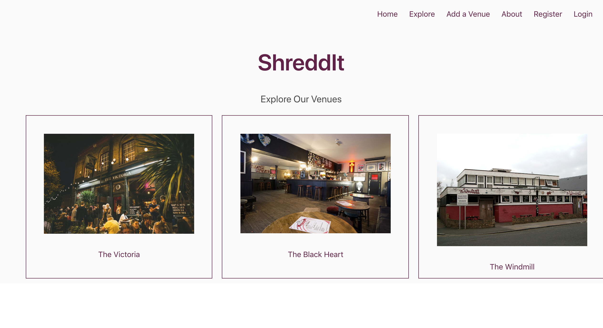

# ShreddIt

####  Second Project at General Assembly's Web Development Immersive Course

ShreddIt is a platform for reviewing independent music venues, primarily in London. Users can view venues and other users' reviews. Logged-in users can add other venues, comment/rate any of them, edit and delete them.

### Table of Contents

- [Getting Started](#getting-started)
- [Description](#description)
  - [Brief](#brief)
  - [Tools and Technologies Used](#tools-and-technologies-used)
  - [Wireframes](#wireframes)
  - [Screenshots](#screenshots)
  - [Known Issues](#known-issues)
- [Challenges and Wins](#challenges-and-wins)
- [Future Work](#future-work)
- [Contact](#contact)

## Getting Started

#### [Deployed app](https://shred-dit.herokuapp.com)

#### To run locally

Prerequisites: MongoDB installed and `mongod` running

- Clone or download repo
- Install dependencies in the same directory: `yarn` (or your package manager's equivalent command)
- `yarn start` and visit `http://localhost:4000/`

## Description

Fully RESTful web application built solo in a week's time.

###  Brief

My second GA project was supposed to fulfil these requirements:

- 2 models: one representing a user and one that represents the main resource
- a user model and user authentication
- complete RESTful routes for at least one of the resources with all CRUD actions
- styled with Bulma
- deployed online and accessible to the public
- includes relationships - embedded or referenced
- includes wireframes designed before building the app

### Tools and Technologies Used

Back End | Front End | Other
-------- | --------- | --------
Node.js (v10.11.0) | JavaScript (ES6)| Git
Express.js (v4.16.4) | HTML5 | GitHub
MongoDB (v4.0.2) | CSS3 | InVision
Mongoose (v5.3.7) | SCSS | Heroku
 | EJS (v2.6.1) |
 | Bulma |

### Wireframes

Before starting to code I made sure I planned the project as thoroughly as I could, including a few wireframes using InVision.

###  Screenshots

Home page as seen by a user who isn't logged in

Login page

Explore page with venues listed

Editing a venue

### Known Issues

- layout and styling
- any user can edit and delete venues and other users' ratings

## Challenges and Wins

When you learn how to code everything you see is new, and even learning how linter works, how it helps you and how to listen to its error messages can be challenging. Mine was under the assumption I was working with React and not EJS, and its messages were at first incomprehensible. However it taught me how to use linter effectively and configure settings appropriately.

This was the first single page application I ever made, after a week of learning back end basics and templating, and I was battling the flu while working on it. Despite its limitations it was a great way to learn how to put the various web development pieces together and starting to see how things work on the back end.

## Future Work

If I had more time I would make the interface more user friendly and fix the layout issues. I would also add more useful categories to fill in for venues as well as users, calculate average ratings, add like/dislike buttons, and made the app more secure by allowing users to edit and delete only their own venues and ratings.

## Contact

[Portfolio](http://terezakinnert.com/) | [LinkedIn](https://www.linkedin.com/in/terezakinnert/)
